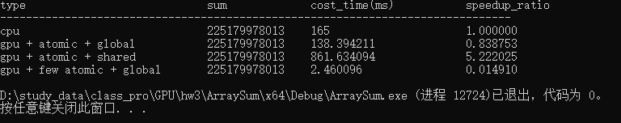

2020-10-16 by congcong
## 介绍
使用cuda编写，多种方式使用GPU求一个数组的和。

## 环境

* vs 2019
* GTX 1660s
* cuda 11.1.74
  
## 方式介绍

1. cpu

2. 使用gpu，从global memory中读取数据，并存入global memory中的一个内存单元。使用atomicAdd实现读写控制。
3. 使用gpu，每一个block求和将结果存入shared memory中的block_result，最后将所有的block_result加起来。读写都需要atomicAdd,并且都需要同步操作__synthreads()。
4. 使用gpu，减少线程数量，分为多个grid, 每个线程计算多个数组单元的和。这里我将block size设置为sm的数量，我的gpu是22。

## 结果与分析

1. 可以看出atomic的效果不明显，因为总的来说还是串行相加的，不过atomic操作应该有指令的优化，所以比cpu要快。

2. 使用shared反而变慢，因为这里没有必要使用shared memory， 只有多次读写的时候使用最好，而这里只需要读一次数组。
   
3. 减少线程数量的速度最快，经过测试，在sm数量22附近设置block size，效果最好。因为这里的kernel都是可以直接执行的，所以不存在挂起引起blcok的切换。
